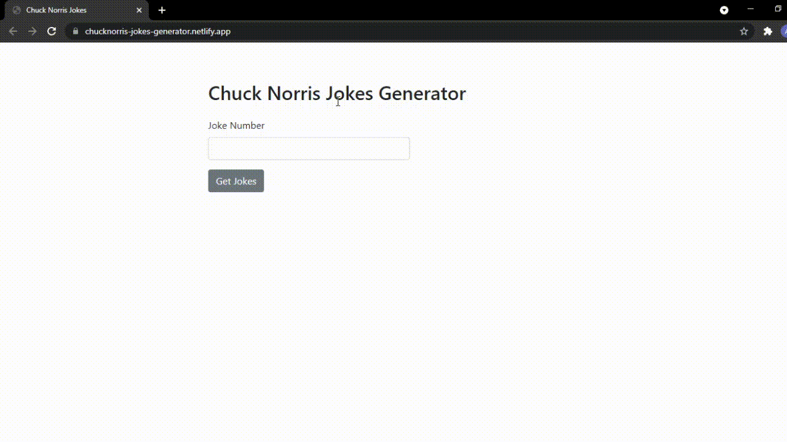

# ChuckNorris-Jokes-Generator
Chuck Norris Jokes Generator built with Vanilla JS USING ChuckNorris Jokes API.

## Features
- Generate number of jokes specified by user.

### Preview

### Screenshot

            This is a desktop View.

             This is for mobile view.

   
  

  
### Links

- [Live Site URL](https://chucknorris-jokes-generator.netlify.app/)
- [Youtube](https://youtu.be/DaCVovlGFsU)

### Built with

- Semantic HTML5 markup
- Bootstrap 5
- Vanilla JS(AJAX and DOM Manipulations)

## Author

- [Instagram](https://www.instagram.com/albert_sigsbert/)
- [LinkedIn](https://www.linkedin.com/in/albertsigsbert/)
- [Twitter](https://twitter.com/albert_sigsbert)

